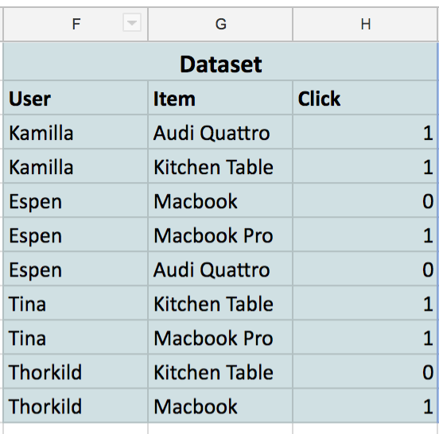
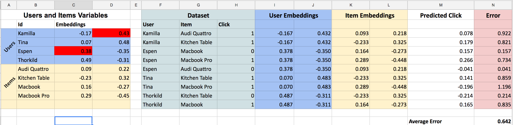
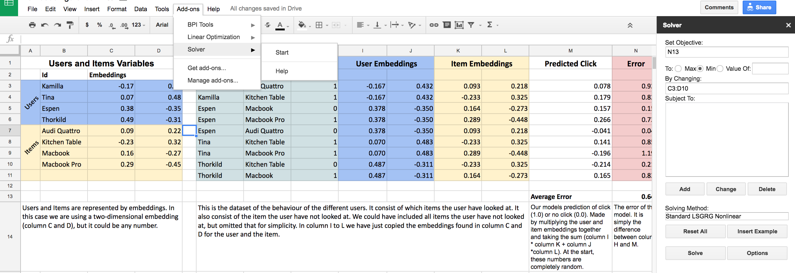
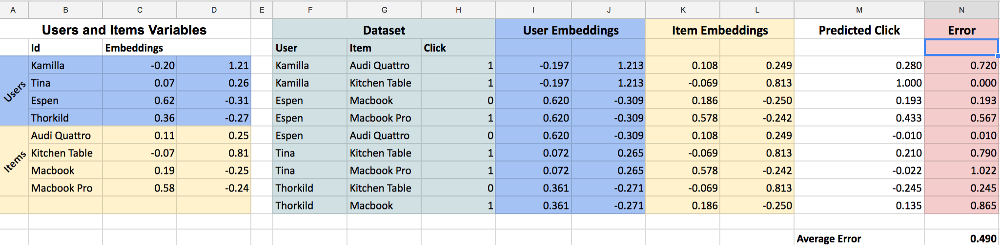
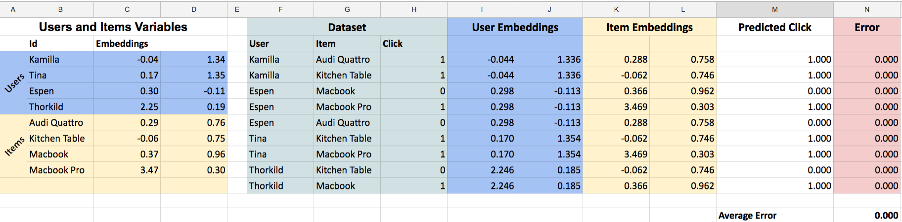

---
aliases:
- /matrix factorization/recsys/2017/05/28/CFexcel
categories:
- matrix factorization
- recsys
date: '2017-05-28'
layout: post
title: Collaborative Filtering Recommendations in Spreadsheets

---

Most people have a love-hate relationship to spreadsheets.
The spreadsheet format is simple and intuitive, and doing calculations becomes really easy.
However, they quickly become too complicated as well.

[Jeremy Howard's lecture](http://course.fast.ai/lessons/lesson6.html) explaining embeddings was a great use of Excel,
and I implemented my own version of his excel-sheet using it for illustration purposes on how recommendation algorithms work.

Recommendations are everywhere: Netflix is trying to propose the most relevant movies,
and Google is serving you personalised ads that are hopefully a (little less) annoying.
The gold standard algorithm is collaborative filtering.
The idea of collaborative filtering is to be able to find relevant items to recommend a user given what the user looked at before.

The full excel sheet can be found [here](https://docs.google.com/a/eidedatalab.no/spreadsheets/d/1n2lMBF7VNMdNd9OnvlcAujd7fWjstYC3y8cfMVtJGRU/edit?usp=sharing)
(it is view-only, so make a copy to try it out!).

You start off getting your dataset.
In our case it consist of four users that have clicked or not clicked on four different items:

The goal of a collaborative filtering model is to predict this data.
That is, if we give the model the user "Espen" and the item "Macbook Pro",
it should be able to predict a number close to one.

The model is parameterised by giving each user and each item two random numbers each.
We call these numbers for "embeddings":

We say that our model predicts a click/no click on a pair of user and item by multiplying the embeddings.
That is, we find the first embedding of Espen and multiplies it with the first embedding of the Macbook Pro.
Then, we do the same for the second embedding.

-0.38*0.29 + -0.35*-0.45 = 0.048

That is pretty far from 1 (which is the number the model tries to predict).
However, we have not _trained_ the model yet, so it is pretty dumb so far.

The full excel sheet looks like this:

We have seen column A to H already.
Column I to L is just a copy of the embeddings from the users and items shown in the dataset.
Column M is the prediction of the model (see that Espen has a 0.048 score for the Macbook Pro).
Finally, column N tells us how far off we are at that particular prediction (0.952 for Espen's case).

Since we want to make our predictions as close as the truth as possible (the truth is column H),
we could say that we want as small errors as possible.
That would be the same as saying we want the smallest Average Error possible (N13).
The way we will get that is to alter these embeddings.
If we can get those embeddings to be at certain values such that our average error is close to zero, we have made it!

One way to go forward is to change these numbers manually.
If I change the sign of the first embedding of Espen to something positive I will get a higher prediction for the macbook pro.
Also, if I change the sign of the second embedding of Kamilla I will also decrease the error.
Now it looks like this:

We have managed to decrease the average error from 0.71 to 0.64!
Now, its pretty hard to do this by hand,
so to help me I installed a little Add-on called "solver" in google spreadsheets.
Basically what it does it to minimize cell N13 (which is where we have calculated our Average Error)
by changing cells C3:D10 (that is where we have put all our embeddings (random numbers)).

After pressing "Solve" the thing changes the embeddings and comes up with an error of 0.49!
You can see it came up with better numbers so that our predictions (column M) are closer to the actual truth (column H).

Doing this another time I actually get an average error of zero.
Our model is perfectly predicting all the observations we have in the dataset,
and we are done!

The "real" collaborative filtering algorithms that operate in the wild is very similar to this one.
They use more data and use more than two embeddings per user.
At FINN.no, we are maybe using 200m datapoints and 100 "embedding-numbers" to make a recommendation model.
Getting an error of zero is of course not normal.
Real people are complicated, contradictive and noisy.

We're also not doing it in Excel, but spark and tensorflow.
Have a look at the presentation [I held]() for Oslo Data Science Meetup if you want to know more about that.
