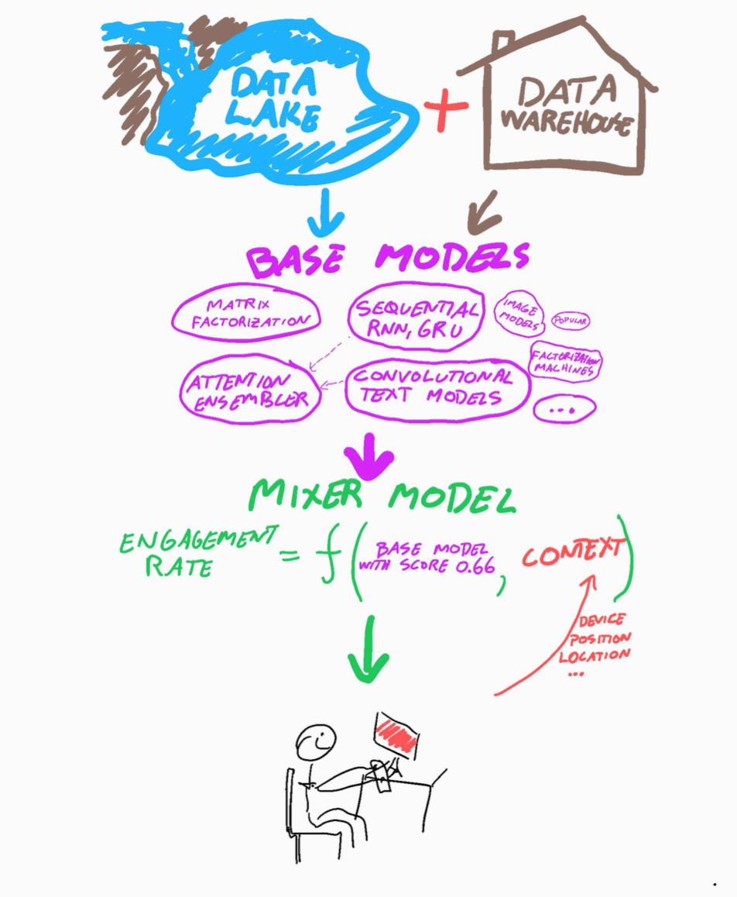

---
aliases:
- /recsys/carprice/autonomous cars/2018/01/03/talks-and-projects-2017
categories:
- recsys
- carprice
- autonomous cars
date: '2018-01-03'
layout: post
title: Deep Recommenders, Car Pricing, Self driving rc-car and other projects in 2017
toc: true

---

I am not a fan of new years resolutions.
If I had been, one of my new years resolutions would be to be better at writing down what I am doing all the time.
However, I held some talks and did some fun experiments in 2017, so the cheap way is simply to link to those.

### How to become a Data Scientist in 20 minutes (JavaZone 2017)
At Javazone 2017 I held a short talk on how building (drum roll) _machine learning algorithms_ is actually pretty easy.
Simply put: I build a regression model that would predict the fair price of a car,
and then I explained how I used that model to actually buy the car.
The main message was that as long as you do your model validation properly (dont train and test on same data),
you dont really need to understand the algorithm to get good results (use random forest!).

We [**published both algorithm and the dataset here**](https://github.com/simeneide/car-pricing) so that anyone could replicate it, and JavaZone even filmed it:

<iframe src="https://player.vimeo.com/video/233848280" width="640" height="360" frameborder="0" webkitallowfullscreen mozallowfullscreen allowfullscreen></iframe>

### Algorithms we are using in FINN.no to recommend you good stuff

I have actually held three talks on this.
First off was the one
[I held at Oslo Data Science meetup](https://simeneide.github.io/recommendations/2017/03/16/osloDataSciencePresentation.html)
in February, where I talked about the journey we did from pure CF-models to using Tensorflow.

After that we have tried out a lot of things,
and also moved to use keras instead, so we could skip all the boilerplate.
Ive held two talks this fall on it:
one beer-talk hosted by Bekk Consulting, and one early-morning talk with Bearpoint.
The presentations were very similar, and can be [**downloaded here**](/assets/2017-10-10-eide-finn-personalization-BekkBearingpoint.pdf).

<blockquote class="twitter-tweet" data-lang="en">
Testing RNN <a href="https://twitter.com/hashtag/recommenders?src=hash&amp;ref_src=twsrc%5Etfw">#recommenders</a> for <a href="https://twitter.com/FINN_tech?ref_src=twsrc%5Etfw">@FINN_tech</a>. The RNN (bottom) generalize better when looking at last 10 items compared to only the last (mid). <a href="https://t.co/feZMcz1n97">pic.twitter.com/feZMcz1n97</a>
&mdash; Simen Eide (@simeneide) <a href="https://twitter.com/simeneide/status/903272337960824834?ref_src=twsrc%5Etfw">August 31, 2017</a></blockquote>

### Workshop for FINN developers on Machine Learning

In November I held a 3 hour workshop with some colleages on machine learning.
The idea was, just as in the javazone talk, to demystify building these models.
We spun up GPU machines to all the participants,
prepared a dataset many FINN ads and a baseline script on how they could classify the ads based on their title.
It was around 500'000 ads spread over 20 or so categories.
The task was then to understand the baseline algorithm, then improve it by changing architechture, learning rates, optimizers and so on.
The baseline started by taking averages of the word2vec vectors of the title,
but the winners used a GRU-layer on the title to snitch the last percentage points on the validation accuracy.
That was really impressive, none of them had done machine learning before, and then they start tinkering with recurrent neural nets!

<blockquote class="twitter-tweet" data-lang="en">
Data scientist beware! Sixty developers at <a href="https://twitter.com/FINN_tech?ref_src=twsrc%5Etfw">@FINN_tech</a> with no prior <a href="https://twitter.com/hashtag/MachineLearning?src=hash&amp;ref_src=twsrc%5Etfw">#MachineLearning</a> experience just build a deep neural classifier in 2.5hrs that beat my model! <a href="https://t.co/HmG29pi7mM">pic.twitter.com/HmG29pi7mM</a>
&mdash; Simen Eide (@simeneide) <a href="https://twitter.com/simeneide/status/933011881371099136?ref_src=twsrc%5Etfw">November 21, 2017</a></blockquote>

### Clothing GANs
We had a little GAN-workshop at the end of the year here, where we among other things trained a model to generate new clothing.
I was impressed how easy that was.
Maybe FINN should start generating images of your ad if you cant be bothered to take your own photos? ;)

<blockquote class="twitter-tweet" data-lang="en">
Do you need to sell off some clothes at <a href="https://twitter.com/FINN_tech?ref_src=twsrc%5Etfw">@FINN_tech</a>, but not happy with your own image? This is our first try at building a <a href="https://twitter.com/hashtag/GAN?src=hash&amp;ref_src=twsrc%5Etfw">#GAN</a> model that can generate arbitrary clothing images for you! Next steps: upscaling, conditioning and maybe a fashion show? <a href="https://t.co/Vkd7takdHT">pic.twitter.com/Vkd7takdHT</a>
&mdash; Simen Eide (@simeneide) <a href="https://twitter.com/simeneide/status/942370686257041410?ref_src=twsrc%5Etfw">December 17, 2017</a></blockquote>

### Neural Search Engines

Ive tried to work on models that take text input and outputs a finn ad (aka search engine).
They were also enhanced with user-features, so that the search would be personalized to the exact user.
It worked all right, but we are currently working on a "simpler" way to personalize FINNs search results,
combining the good old search engine with our recommendation models.

<blockquote class="twitter-tweet" data-lang="en">
Search engines are maybe not the most sexy, but it was really fun to learn a model to predict our <a href="https://twitter.com/hashtag/recommendation?src=hash&amp;ref_src=twsrc%5Etfw">#recommendation</a> vectors based on a word! <a href="https://t.co/yPDsLkKYxc">pic.twitter.com/yPDsLkKYxc</a>
&mdash; Simen Eide (@simeneide) <a href="https://twitter.com/simeneide/status/905085732397735937?ref_src=twsrc%5Etfw">September 5, 2017</a></blockquote>

### Self driving rc-car ++

Ive been tinkering a bit with a self driving car.
The project is called [donkeycar](http://www.donkeycar.com).
Basically it is a rc-car that you can run through a python API with a raspberry pi.
They have also integrated tensorflow, so that you can use imitation learning to drive a path.
I got it to follow the road, and also a white line.
Hopes was to spend enough time to build some reinforcement learning into it, but I haven't had time (yet!).

<blockquote class="twitter-tweet" data-lang="en" style="float:left;width:100%">
Bil + nevralt nett = SELVKJØRENDE BIL! Kan jeg claime Norges første selvkjørende amatørbil?! <a href="https://twitter.com/hashtag/autonomousdriving?src=hash&amp;ref_src=twsrc%5Etfw">#autonomousdriving</a> <a href="https://twitter.com/hashtag/donkeycar?src=hash&amp;ref_src=twsrc%5Etfw">#donkeycar</a> <a href="https://twitter.com/hashtag/in?src=hash&amp;ref_src=twsrc%5Etfw">#in</a> <a href="https://twitter.com/hashtag/DeepLearning?src=hash&amp;ref_src=twsrc%5Etfw">#DeepLearning</a> <a href="https://t.co/vwZJcfLqLd">pic.twitter.com/vwZJcfLqLd</a>
&mdash; Simen Eide (@simeneide) <a href="https://twitter.com/simeneide/status/898611037385117696?ref_src=twsrc%5Etfw">August 18, 2017</a></blockquote>

<blockquote class="twitter-tweet" data-lang="en" style="float:right;width:100%">
Our self driving project isnt fast, but atleast can go on forever. Driving using a single neural network on a raspberry PI <a href="https://twitter.com/hashtag/donkeycar?src=hash&amp;ref_src=twsrc%5Etfw">#donkeycar</a> <a href="https://t.co/6y5sf8AnMi">pic.twitter.com/6y5sf8AnMi</a>
&mdash; Simen Eide (@simeneide) <a href="https://twitter.com/simeneide/status/924223645592977408?ref_src=twsrc%5Etfw">October 28, 2017</a></blockquote>

<blockquote class="twitter-tweet" data-lang="en">
How my <a href="https://twitter.com/hashtag/donkeycar?src=hash&amp;ref_src=twsrc%5Etfw">#donkeycar</a> is detecting road, grass and horizon for <a href="https://twitter.com/hashtag/autonomousdriving?src=hash&amp;ref_src=twsrc%5Etfw">#autonomousdriving</a>. Slow and steady progress.. <a href="https://t.co/VlL3hGmcWn">pic.twitter.com/VlL3hGmcWn</a>
&mdash; Simen Eide (@simeneide) <a href="https://twitter.com/simeneide/status/903765232199356420?ref_src=twsrc%5Etfw">September 1, 2017</a></blockquote>

