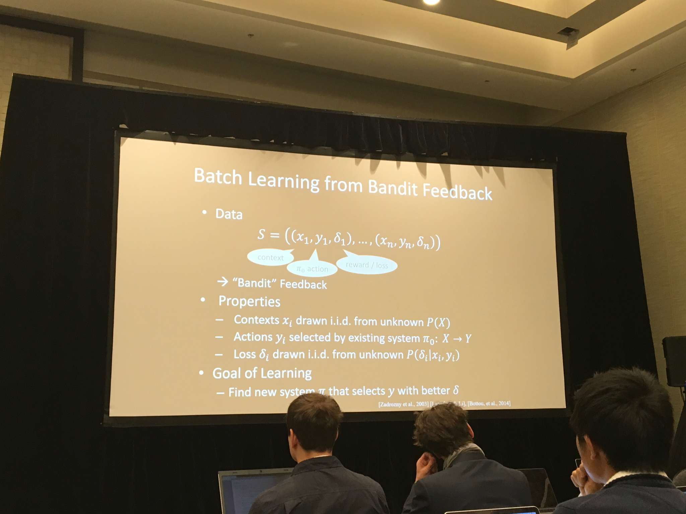
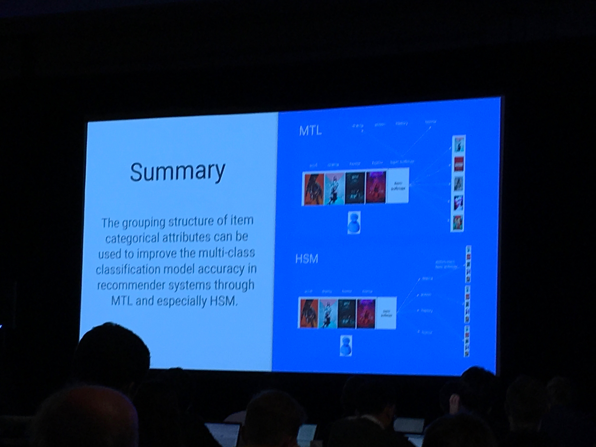

---
aliases:
- /recsys/conference/2018/10/06/recsys2018
categories:
- recsys
- conference
date: '2018-10-06'
layout: post
title: Takeaways Recsys 2018
toc: true

---

For the first time Ive actually made a summary of all the papers and presentations I found noteworthy at a conference (allright, there were more, but this is a start).
Below is my notes, with links etc.
The purpose of the notes is mainly for myself to remember and revisit what I found interesting, but I see no reasons not to share to others.
Does not include my own [paper]( ).

### Keynote dlrs - Joachims: Deep learning with logged bandit feedback

- Paper: http://www.cs.cornell.edu/people/tj/publications/joachims_etal_18a.pdf
- idea: utilize current policy to build a better contextual bandits to recommend.
- using Inverse Propensity Scoring
- Using Self-normalizing IPS estimator (SNIPS)
- Also using self normalizing

A very similar talk seem to be posted here:

<iframe width="560" height="315" src="https://www.youtube.com/embed/lzA5K4im2no" frameborder="0" allow="autoplay; encrypted-media" allowfullscreen></iframe>

### Youtube, Minmin Chen: Off-policy correction for a REINFORCE Rec system

- Invited talk on the evaluation workshop REVEAL
- Youtube shared their work on how the models they used now works, focus on evaluation
- Maximized recommendations based on expected future reward
- they do not use td to train the model, rather the all the actual future rewards and discounts them to get training signal.

- Corrects off-policy updates with importance sampling/IPS

- Exploration is costly, so they tune ut with an extra weight that they set.
- Recommends a set of top K items. Assume additive rewards:

#### Results
- Improved recs, also able to recommend more items into the tail.

### Recsys-competition winners: Two-stage model for Automatic Playlist Continuation at Scale

- Challenge website: http://www.recsyschallenge.com/2018/
- Winner paper: http://www.cs.toronto.edu/~mvolkovs/recsys2018_challenge.pdf
- Task was to complete a user playlist at spotify.
- A playlist may have be created over a long time.
- Given the first items, predict the last ones.

Approach:

- step 1: Reduce candidate set of all items to 20k by using a temporal convolutional layer.
  + (lstm worked too, but was slower to train and iterate on).
  + The step 1 was really about maximizing recall.
- Step 2: xgboost classifier on these candidates

### Categorical-attributes-based item classification for recommender systems: hiarchical softmax and multi loss

- Paper: https://dl.acm.org/citation.cfm?id=3240367
- Setting: Next item prediction with items within some category structure.
- Using negative sampling during training

- Does the recommender improve by predicting a hiarchical softmax instead of doing multi target prediction?

- Result: Using hiarchical modeling is better than multi target. Testet with MAP@5 on recsys16 dataset and "large propertary dataset".
- Also helps with cold start

Own comments: Unsure of the improvement is due to negative sampling or that you infer more structure in your data/model.

<blockquote class="twitter-tweet" data-lang="en">
&quot;Categorical-Attributes-Based Item Classification for Recommender Systems&quot; by <a href="https://twitter.com/QianZhao3?ref_src=twsrc%5Etfw">@QianZhao3</a> and Google folks lead by <a href="https://twitter.com/edchi?ref_src=twsrc%5Etfw">@edchi</a> - really interesting idea: categorical labels as *outputs* of multitask model you are optimizing when recommending items <a href="https://twitter.com/hashtag/RecSys2018?src=hash&amp;ref_src=twsrc%5Etfw">#RecSys2018</a> <a href="https://t.co/Bkljw0zVFf">https://t.co/Bkljw0zVFf</a> <a href="https://t.co/PavBxdtLaX">pic.twitter.com/PavBxdtLaX</a>
&mdash; Xavier @ #recsys2018🎗🤖🏃 (@xamat) <a href="https://twitter.com/xamat/status/1048331032619970560?ref_src=twsrc%5Etfw">October 5, 2018</a></blockquote>

### Keynote 2 dlrs - Ray Jiang, deepmind: slate recommendation (part 1)

- Relevant paper (seems unpublished): https://arxiv.org/pdf/1803.01682.pdf
- predict a full feed instead of single items
- use a VAE to do this,
- "Works really well".
- Tested on Recsys 2015: was the best slate dataset they could find

https://arxiv.org/abs/1803.01682

### Calibrated Recommendations

- Paper: https://dl.acm.org/citation.cfm?id=3240372
- If you have seen 70% drama and 30% horror, optimizing a recommender on precision, the best solution is to give you 100% drama and get 70% precision.
- The paper suggests to calibrate the recommendations to be more representative.
- Done by regularizing the recommendations with the KL divergence of categories (genres in this case)
- Done as a post processing step.
- Result: Can rerank top recommendations to a much more representative distribution without losing accuracy.

https://dl.acm.org/citation.cfm?id=3240372

### Explore, Exploit, and Explain: Personalizing Explainable Recommendations with Bandits

- Paper: https://dl.acm.org/citation.cfm?id=3240354
- Feed-bandit that uses a factorization machine to predict and explain recommendations
- context: Home page of spotify account. Different shelves of recommendations, each with an explanation ("because you recently listened to..")

### Invited talk Netflix: Correlation & Causation
- Yves Raimond, AI director Netflix
- Netflix's approach: personalize everything
- Made some thoughts about the do operator P(Y | do(X))
- Maybe better for recs to focus on P(click | do(X)) - P(click | not do X)

- IPS:
 + pro: simple, model-agnostic
 + con: only unbiased if no unobserved cofounders, high variance
- Alternative til IPS: Instrumental Variable
 + used in econometrics
 + pro: robust to unobserved cofounders
 + con: bias/var depends on strength of IV, hard to scale

### Generation meets recommendation - "Generating new items that fit most users"
- Paper: https://arxiv.org/abs/1808.01199

> - "Consider a movie studio aiming to produce a set of new movies for summer release: What types of movies it should produce? Who would the movies appeal to?"
- "Specifically, we leverage the latent space obtained by training a deep generative model---the Variational Autoencoder (VAE)---via a loss function that incorporates both rating performance and item reconstruction terms."
- "We then apply a greedy search algorithm that utilizes this learned latent space to jointly obtain K plausible new items, and user groups that would find the items appealing."

### On the robustness and discriminative power of information retrieval metrics for top-N recommendation
- Paper: https://dl.acm.org/authorize.cfm?key=N668684
- An evaluation of robustness of many offline metrics at different ranking level. E.g. MRR@5, Recall@10, MAP@100, ...

- Takeaway 1: Use a high cutoff (e.g. 100 instead of 10) when doing offline evaluations, like MRR. The metric is more robust, and highly correlated to the MRR@10 values
- Takeaway 2: MRR is one of the lesser robust offline metrics.

Takeaway 2: mrr er ganske lite robust.

### Unbiased offline recommender evaluation for missing-not-at-random implicit feedback

> Implicit-feedback Recommenders (ImplicitRec) leverage positive only user-item interactions, such as clicks, to learn personalized user preferences. Recommenders are often evaluated and compared offline using datasets collected from online platforms. These platforms are subject to popularity bias (i.e., popular items are more likely to be presented and interacted with), and therefore logged ground truth data are Missing-Not-At-Random (MNAR).

- "Average over all" estimators are biased in Implicit rec datasets
- Use IPS to evaluate policies.
- reduce bias with 30% in a yahoo! music datset.
- Paper: https://dl.acm.org/citation.cfm?id=3240355

### RecoGym

- Simulation environment where you can evaluate your recommender agent
- Follows the same style as openAI gym: env.step(action)
- When we tried it a bit the day before, the users seemed to click on the same items over and over again, probably some tuning that needs to be done there?
- This is sort of an alternative approach to offline evaluation. Simulators are limited by their generating model, but can we still use it to test algorithms for convergence etc?

- Unrelated to talk and recogym, but some notes me and Olav did on rec simulations during conf. Same ideas:

### News session-based recommendations using DNN

- A recommendation algorithm to recommend news.
- Freshness and coldstart big problems.
- Separate item representation that uses a lot of content, independent of users
- Unfortunately not tested in prod (authors from large news corp.)
- Tested on offline data: Beats everything, incl gru4rec ++
- Paper: https://arxiv.org/abs/1808.00720
- Code: https://github.com/criteo-research/reco-gym

### What happens if users only share last n days of data? (Exploring recommendations under user-controlled data filtering)

> - "Using the MovieLens dataset as a testbed, we evaluated three widely used collaborative filtering algorithms."
- "Our experiments demonstrate that filtering out historical user data does not significantly affect the overall recommendation performance."
- Impacts those who opted out (naturally)

Paper: https://scholar.google.com/citations?user=Vyj2jeoAAAAJ&hl=en#d=gs_md_cita-d&p=&u=%2Fcitations%3Fview_op%3Dview_citation%26hl%3Den%26user%3DVyj2jeoAAAAJ%26citation_for_view%3DVyj2jeoAAAAJ%3A2osOgNQ5qMEC%26tzom%3D420

### Interactive recommendation via deep neural memory augmented contextual bandits

- created a recsys simulator? check out...
- Paper: https://dl.acm.org/citation.cfm?id=3240344
