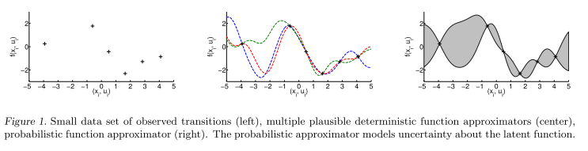
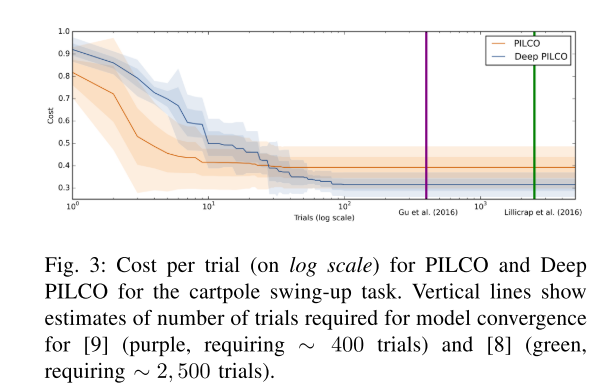

---
aliases:
- /RL/2019/01/17/pilco+improve
categories:
- RL
date: '2019-01-17'
image: assets_old/pilco-preview.png
layout: post
title: PILCO and Deep PILCO

---

Papers: 
- [Deisenroth, M. P., & Rasmussen, C. E. (2011). PILCO: A model-based and data-efficient approach to policy search. Proceedings of the 28th International Conference on Machine Learning, ICML 2011, 465–472.](https://www.researchgate.net/publication/221345233_PILCO_A_Model-Based_and_Data-Efficient_Approach_to_Policy_Search)
- [Gal, Y., Mcallister, R. T., & Rasmussen, C. E. (2016). Improving PILCO with Bayesian Neural Network Dynamics Models. Data-Efficient Machine Learning Workshop, ICML, 1–7.](http://mlg.eng.cam.ac.uk/yarin/PDFs/DeepPILCO.pdf)

The papers shows how to find good policies with relatively few observations on classical control problems (mountain car, pole swing up etc) using probabilistic model based reinforcement learning.

Being model based in reinforcement learning means that you build a statistical model of the environment, a world model.
The RL algorithm can then search for an optimal policy by simulating from this world model.
This is more data efficient than in the "model free" reinforcement learning algorithms, where one needs millions of examples to learn relatively simple games.
However, model based simulators suffers from their approximations to the real world, which often ends up as huge errors when you simulate multiple steps.
By introducing a probabilistic dynamics model, the PILCO algorithms tries to account for the fact that future trajectories are uncertain by introducing parameter uncertainty.
The original PILCO paper does this by using Gaussian Processes, while the deep PILCO use a neural net with the "dropout trick" to approximate a bayesian neural net.

The framework assumes that the world model is of the form 

$x_t=f(x_{t-1},u_{t-1})$

where $x \in R^d$ is a continuous state of the world at time t,
$u_t \in R^F$ is an action at time t, and f is some function of the real world transition dynamics.

The objective is to find a policy $\pi(x) = u$ that minimize the expectation of a cost function $c(x_t)$ over all time steps:

The policy is found by iterating between learning the posterior of the world transition dynamics and simulating using the dynamics and optimizing the policy:

The original paper uses a gaussian process to model $f(x_t)$, which gives an analytical solution for the posterior.
However, gaussian processes does not scale well for large datasets, and the Deep PILCO paper instead uses a neural net to estimate the same dynamics.
They approximate the posterior using variational inference and minimize the KL-divergence through using dropout, which can be interpreted as a variational bayesian approximation.

Both papers show that their algorithm is more data efficient than current state of the art reinforcement learning algorithms:

